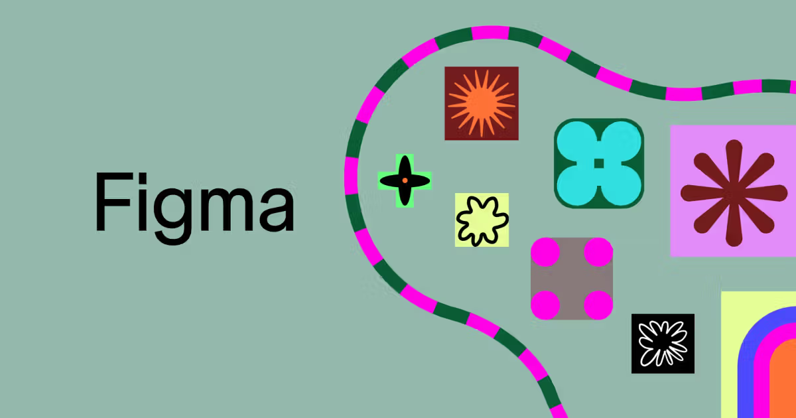

# Intro to Figma

<figure><figcaption>
Figma Website
</figcaption></figure>

> [https://www.figma.com/](https://www.figma.com/)

_The design tool that brings your ideas to life._

Figma is one of the most popular design tools used by UI/UX designers today—and for good reason! It’s an intuitive, browser-based platform that lets you create, collaborate, and share designs easily. Whether you're creating wireframes, user interfaces, or prototypes, Figma helps you do it all in one place.

### Why Figma?

* **Collaboration**: Figma allows you to work with teammates in real-time. No more endless email chains or file versions. Everyone can see and edit the design together.
* **Cloud-Based**: Since Figma is cloud-based, you don’t have to worry about losing your progress. Your work is automatically saved.
* **Beginner-Friendly**: You don’t need to be an expert to start creating. With its easy-to-use interface and countless tutorials, Figma is perfect for both beginners and experienced designers.

### What You Can Do in Figma?

* **Design Interfaces**: Create sleek, interactive designs with ease.
* **Build Prototypes**: Turn your designs into clickable prototypes to test out your ideas.
* **Create Components**: Reuse elements across projects with Figma’s powerful component system.

***

While Figma is a fantastic tool, there are other popular design tools you can explore as well. Some of the top alternatives include:

* **Adobe XD**: A great option for designing and prototyping with a seamless Adobe ecosystem.
* **Sketch**: A vector-based design tool popular for UI design (available for Mac users).
* **Marvel**: A simple tool for design, prototyping, and handoff.
* **InVision**: A powerful tool for prototyping, collaboration, and feedback.

Each of these tools offers unique features, so feel free to explore and see which one suits your style and needs. But for now, let's focus on getting comfortable with Figma!
