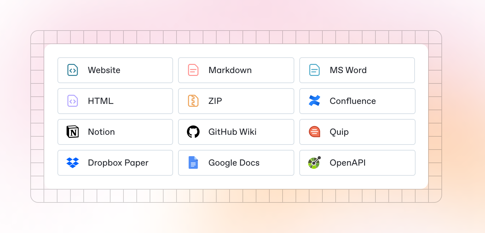

# Localisation

Localisation is the process of adapting a product’s content, layout, language, and functionality to meet the cultural, linguistic, and regional preferences of different target audiences.

It’s not just about translating words — it’s about ensuring your product feels natural, familiar, and usable for people from different regions, cultures, and backgrounds.

<figure><figcaption></figcaption></figure>

### Localisation vs Internationalisation

| Term                        | Meaning                                                                                            |
| --------------------------- | -------------------------------------------------------------------------------------------------- |
| Localisation (L10n)         | The actual process of adapting content, visuals, formats, and functionality for a specific market. |
| Internationalisation (I18n) | Designing a product in a way that makes it easy to adapt for different languages and regions.      |


Internationalisation prepares your product for localisation.


### Localisation Challenges

#### **1. Text Expansion**

Some languages take up more space than others (e.g. German text is often longer than English).

#### **2. Reading Direction**

Left-to-right (LTR) vs. right-to-left (RTL) languages (like Arabic or Hebrew).

#### **3. Cultural Sensitivity**

Avoid culturally inappropriate images, colors, gestures, or expressions.

#### **4. Units & Standards**

Kilograms vs. pounds, kilometers vs. miles, Celsius vs. Fahrenheit.

### What Gets Localised?

| Element             | Example                                                          |
| ------------------- | ---------------------------------------------------------------- |
| Language & Text     | Translations, date formats, number formats, units of measurement |
| Currency & Pricing  | USD vs. JPY vs. EUR, local tax rules                             |
| Date & Time Formats | `DD/MM/YYYY` vs. `MM/DD/YYYY`, 12-hour vs. 24-hour clock         |
| Images & Icons      | Symbols that might mean different things in different cultures   |
| Colors & Meanings   | Red = danger in one culture, good fortune in another             |
| Forms & Inputs      | Address formats, phone numbers, name ordering                    |
| Typography Choices  | Supporting non-Latin scripts like Arabic, Chinese, or Devanagari |
| Voice & Tone        | Formal vs. casual language, slang, humor                         |
